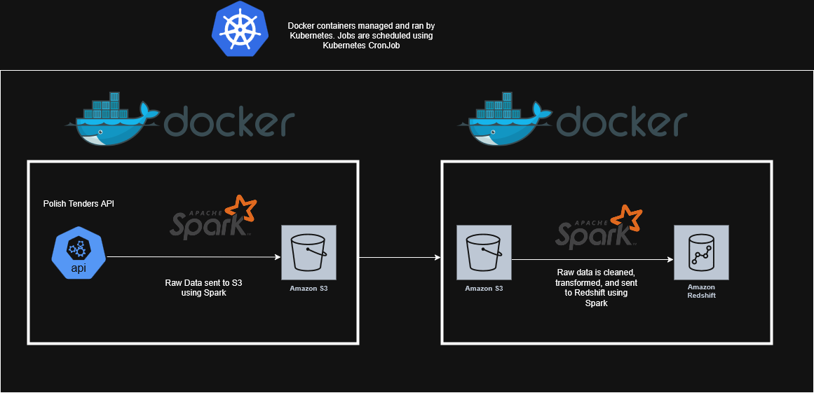

# Polish-Procurement-Data-Processing

## Introduction
The purpose of this project is to build an end to end data engineering pipeline.  It covers each stage from data ingestion to processing and finally to storage, utilizing a robust tech stack that includes Python, Apache Spark, S3, and Redshift. Everything is containerized using Docker for ease of deployment and scalability.

- First, Polish tender data is brought in from a public API, and immediately loaded into an S3 bucket using Apache Spark. After that job is completed, the raw data from S3 is loaded into another Spark job where it gets put into a JSON schema and cleaned. Specific columns are picked out from the JSON and loaded into Redshift for quicker querying times. 

- This project uses Docker containers to ensure a consistent, reliable, and reproducible environment for data engineering workflows. By containerizing our data pipelines and supporting services, we make the project easier to scale, maintain, and deploy.

- While Docker helps us containerize individual components of our data engineering stack, Kubernetes allows us to orchestrate, scale, and manage those containers efficiently—especially as the project grows in complexity. This project uses Kubernetes to manage the docker containers that contain data pipelines and supporting services. It is also used in scheduling batch jobs using Kubernetes cron jobs. 

- Apache Spark is used to ingest, load, clean, and transform data in this project. Spark is used to ingest data from S3, and load data into S3 and Redshift.

- Data Source: We will use https://tenders.guru/pl/api#get-tender-details - a Polish procurement API to get procurement data in JSON format.

## System Architecture

### How to run:
- First, make docker images using docker files and python scripts.
     - Download dockerfiles and python scripts into a file system.
     - Using Docker, cd into the raw_to_s3 folder and input this command into docker: docker build -t raw_to_s3_2 .
     - Then cd into the s3_to_rs folder and use this command in docker: docker build -t s3_to_rs_2 .
- Spin up a Kubernetes cluster
     - Then apply the Kubernetes pod spec. This will run the docker images: kubectl apply -f bb.yaml
     - Watch the logs of the data pipeline with: kubectl get pods -w

- ### Data Description
Each item in the JSON contains data is a procurement tender published from Poland. A procurement tender is a formal, competitive process where an organization, typically public but also private, invites potential suppliers to submit bids for the provision of goods, services, or works. 

Below is one of the tenders in the JSON.

{'id': '586948', 
   'date': '2023-05-03', 
   'title': 'Dostawa licencji IBM wraz z 12 miesięcznym wsparciem technicznym producenta', 
   'category': 'supplies', 
   'description': '1. Przedmiotem zamówienia jest dostawa licencji wraz z zapewnieniem 12 miesięcznego wsparcia technicznego Producenta dla:\n1.1. IBM Db2 Standard Edition Cartridge for IBM Cloud Pak for Data Virtual Processor Core License + SW Subscription &amp; Support 12 Months “lub równoważnym” – 60 sztuk;\n1.2. IBM Db2 Advanced Edition AU Option for Non-Production Environments Authorized User License + SW Subscription &amp; Support 12 Months “lub równoważnym” – 8 sztuk;\n1.3. IBM WebSphere Hybrid Edition Virtual', 
   'sid': 'award:171361', 
   'awarded_value': '2817192.00', 
   'awarded_currency': 'PLN', 
   'awarded_value_eur': '611701.66', 
   'purchaser': {'id': '27317', 'sid': None, 'name': None}, 
   'type': {'id': 'procedura-otwarta', 
    'name': 'Procedura otwarta', 
    'slug': 'procedura-otwarta'}, 
   'awarded': [{'date': '2023-04-24', 
     'value_for_two': 2817192, 
     'value_for_two_eur': 611701.66, 
     'suppliers': [{'name': 'Techsource Sp. z o.o. (Lider Konsorcjum)', 
       'id': 28414,
       'slug': 'techsource-sp-z-o-o-lider-konsorcjum'},
      {'name': 'Decsoft S.A. (Konsorcjant)',
       'id': 28415,
       'slug': 'decsoft-s-a-konsorcjant'}], 
     'value_min': '0.00', 
     'value_for_three': 2817192, 
     'value_for_one_eur': 0, 
     'count': '1', 
     'value_for_one': 0, 
     'value_for_three_eur': 611701.66, 
     'suppliers_id': '28414,28415', 
     'value_eur': 611701.66, 
     'value_max': '0.00', 
     'offers_count': [2], 
     'suppliers_name': 'Techsource Sp. z o.o. (Lider Konsorcjum) Decsoft S.A. (Konsorcjant)', 
     'value': '2817192.00', 
